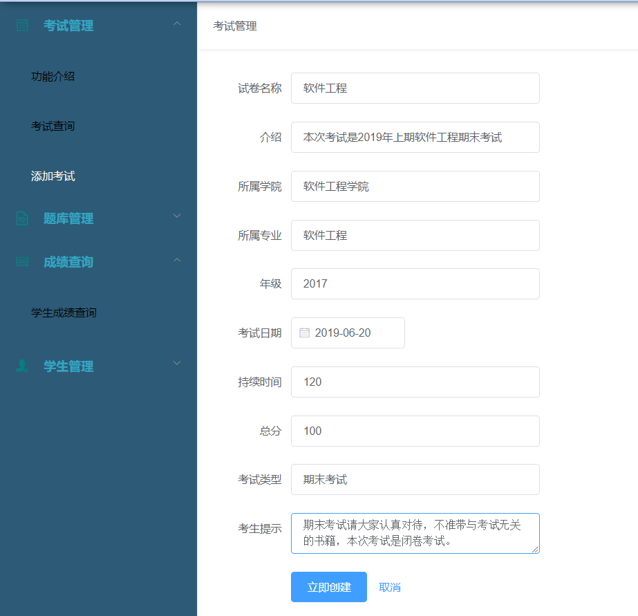

# ExamManageSystem

## 老师功能
* 考试管理
  - 考试查询
  - 添加考试
* 题库管理
  - 查询题库
  - 增加题库
* 成绩查询
  - 按名字查询
  - 按科目查询
* 学生管理
  - 编辑、删除学生
  - 添加学生

## 管理员功能
* 考试管理
  - 考试查询
  - 添加考试
* 题库管理
  - 查询题库
  - 增加题库
* 成绩查询
  - 按名字查询
  - 按科目查询
* 学生管理
  - 编辑、删除学生
  - 添加学生
* 教师管理
  - 编辑、删除教师
  - 添加教师
 
 ## 学生功能
* 我的试卷
  - 查看试卷
  - 答卷
* 我的练习
  - 查看做题记录
* 我的分数
* 留言功能

 ## 内容示例
  
  
  
  
  
  
  
  
  
  
  
  
  
  
  
  
